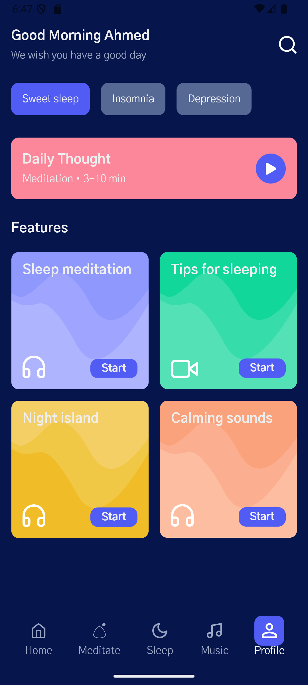

# Meditation App UI

A modern meditation app UI built with Jetpack Compose. This project is an implementation of a meditation app UI tutorial by [Philipp Lackner](https://www.youtube.com/watch?v=g5-wzZUnIbQ), based on a design from [Dribbble](https://dribbble.com/shots/15822493-Meditation-Mobile-App).

<p align="center">
  
</p>

## About This Project

This is a learning project that recreates a meditation app UI using Jetpack Compose. The implementation follows Philipp Lackner's tutorial, which demonstrates modern Android UI development practices.

## Features

- 🎨 Modern UI with Material Design 3
- 💫 Custom animations and path drawings
- 🎨 Custom color schemes and typography
- 📱 Responsive layout design
- 🔥 Bottom navigation with smooth state handling
- 🎯 Interactive feature cards with beautiful gradients

## UI Components

### Home Screen
- Personalized greeting section
- Category chips for quick navigation
- Daily meditation card
- Feature grid with animated cards
- Custom bottom navigation bar

### Feature Cards
- Custom path animations
- Gradient backgrounds
- Interactive elements
- Material Design typography

### Bottom Navigation
- Smooth state transitions
- Custom icons
- Active/Inactive states
- Responsive layout

## Tech Stack

- 🤖 Android
- 📱 Jetpack Compose
- 🎨 Material Design 3
- 🌈 Custom Canvas drawings
- 💾 State management with Compose State

## Getting Started

1. Clone this repository
```bash
git clone https://github.com/yourusername/MeditationApp.git
```

2. Open the project in Android Studio

3. Run the app on an emulator or physical device

## Requirements

- Android Studio Arctic Fox or later
- Minimum SDK: 21
- Target SDK: 34
- Kotlin version: 1.9.0 or later

## Credits

This project is based on:
- Original Design: [Meditation Mobile App](https://dribbble.com/shots/15822493-Meditation-Mobile-App) on Dribbble
- Tutorial Implementation: [Philipp Lackner's Meditation UI Tutorial](https://www.youtube.com/watch?v=g5-wzZUnIbQ)

## Acknowledgments

- Philipp Lackner for the excellent Jetpack Compose tutorial
- Original design creators on Dribbble
- Material Design Icons
- Jetpack Compose Documentation
- Android Development Community

---
Made with ❤️ using Jetpack Compose
