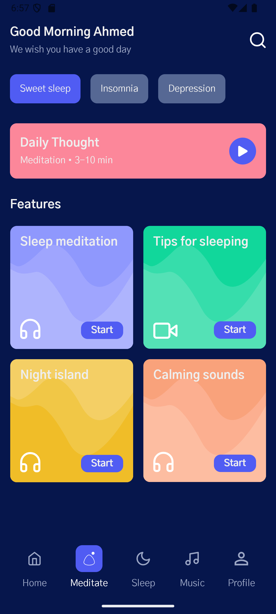

# Meditation App UI

A modern meditation app UI built with Jetpack Compose. This project demonstrates the implementation of a clean and calming user interface for a meditation application using Material Design 3 components and custom animations.

<p align="center">
  
</p>

## Features

- 🎨 Modern UI with Material Design 3
- 💫 Custom animations and path drawings
- 🎨 Custom color schemes and typography
- 📱 Responsive layout design
- 🔥 Bottom navigation with smooth state handling
- 🎯 Interactive feature cards with beautiful gradients

## UI Components

### Home Screen
- Personalized greeting section
- Category chips for quick navigation
- Daily meditation card
- Feature grid with animated cards
- Custom bottom navigation bar

### Feature Cards
- Custom path animations
- Gradient backgrounds
- Interactive elements
- Material Design typography

### Bottom Navigation
- Smooth state transitions
- Custom icons
- Active/Inactive states
- Responsive layout

## Tech Stack

- 🤖 Android
- 📱 Jetpack Compose
- 🎨 Material Design 3
- 🌈 Custom Canvas drawings
- 💾 State management with Compose State

## Getting Started

1. Clone this repository
```bash
git clone https://github.com/yourusername/MeditationApp.git
```

2. Open the project in Android Studio

3. Run the app on an emulator or physical device

## Requirements

- Android Studio Arctic Fox or later
- Minimum SDK: 21
- Target SDK: 34
- Kotlin version: 1.9.0 or later

## Project Structure

```
app/
├── src/
│   ├── main/
│   │   ├── java/
│   │   │   └── com/example/meditationapp/
│   │   │       ├── ui/
│   │   │       │   ├── theme/
│   │   │       │   │   ├── Color.kt
│   │   │       │   │   ├── Theme.kt
│   │   │       │   │   └── Type.kt
│   │   │       │   └── HomeScreen.kt
│   │   │       └── MainActivity.kt
│   │   └── res/
│   │       └── drawable/
│   │           └── [icons and images]
│   └── androidTest/
└── build.gradle.kts
```

## Contribution

Feel free to contribute to this project by:
1. Fork it
2. Create your feature branch (`git checkout -b feature/amazing-feature`)
3. Commit your changes (`git commit -m 'Add some amazing feature'`)
4. Push to the branch (`git push origin feature/amazing-feature`)
5. Open a Pull Request

## License

This project is licensed under the MIT License - see the [LICENSE](LICENSE) file for details.

## Acknowledgments

- Material Design Icons
- Jetpack Compose Documentation
- Android Development Community

---
Made with ❤️ using Jetpack Compose
